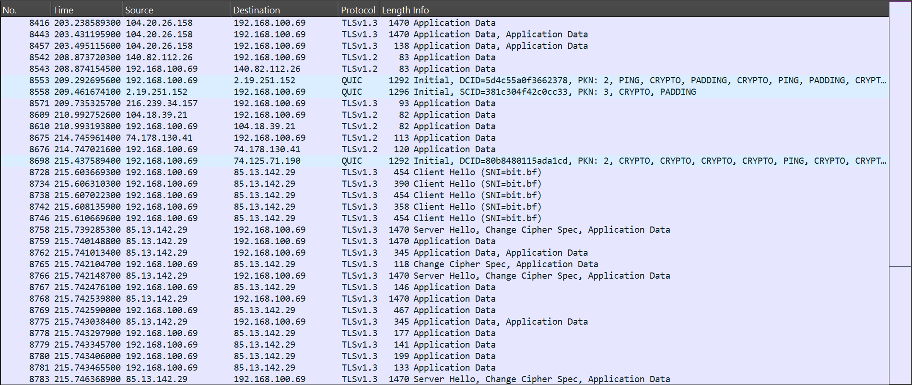

# Cybersecurity Hands-On Lab — Module 1
### Understanding Basic Security Weaknesses

| Field | Details |
|---|---|
| **Student** | GUISSOU Ali |
| **Instructor** | Lebian Wilfried NIKIEMA, Ph.D |
| **Date** | March 16, 2026 |
| **Course** | Introduction to Cybersecurity |

---

## Table of Contents

1. [Lab Overview](#lab-overview)
2. [Part 1 — Password Security](#part-1--password-security)
3. [Part 2 — Network Traffic Capture](#part-2--network-traffic-capture)
4. [Part 3 — Packet Analysis](#part-3--packet-analysis)
5. [Analysis & Findings](#analysis--findings)
6. [Key Takeaways](#key-takeaways)

---

## Lab Overview

This hands-on laboratory introduced core cybersecurity concepts through practical work with Wireshark, a powerful network protocol analyzer. Over the course of this session, we explored password security principles and examined real network traffic to understand why encryption and strong authentication are not optional—they're essential foundations of modern digital security.

---

## Part 1 — Password Security

### Understanding Weak Passwords

Let's start with a sobering reality: the following passwords are among the most commonly used—and most dangerous—choices people make:

| Password | The Problem |
|---|---|
| `123456` | Purely numeric and sequential—the #1 most used password globally |
| `password` | A dictionary word that any automated tool can guess instantly |
| `admin` | The default credential for countless systems; attackers try this first |
| `12345678` | Still just numbers in order, slightly longer but equally weak |
| `qwerty` | A keyboard pattern that appears in every cracker's wordlist |

**Why these passwords fail so badly:**

Modern password-cracking tools can test millions of combinations every second. They employ two primary strategies: dictionary attacks (systematically trying known words and common passwords) and brute-force attacks (testing every possible character combination). A password like `123456` typically falls within seconds.

### Building Strong Passwords

Strong passwords follow a simple but powerful rule: length plus complexity. These examples meet the requirements (minimum 12 characters with uppercase, lowercase, numbers, and special characters):

1. `G!u1ss0u_S3cur3`
2. `Cy83r#Lab@2026!`
3. `N3tw0rk$Pr0t3ct!`

What makes these resilient is not just their length, but the mix of character types and the absence of recognizable patterns. Dictionary attacks become futile against them.

---

## Part 2 — Network Traffic Capture

### The Experiment Setup

We launched Wireshark and began capturing network traffic over approximately two minutes of normal web browsing. The results were striking: **thousands of packets** flowing across the network interface, spanning multiple protocols and serving different purposes.

### DNS Traffic — Domain Name Resolution

**What we observed:**

The machine at `192.168.100.69` was actively querying the DNS resolver at `192.168.100.1` to translate domain names into IP addresses. The captured traffic revealed queries for domains including `bit.bf`, `opentor.org`, `safebrowsing.google.com`, `www.google.com`, `www.bing.com`, and `dns.msftncsi.com`. Each query received a standard DNS response containing the resolved IP address.

### HTTP Traffic — The Unencrypted Web

**What we observed:**

Multiple `GET /ncsi.txt HTTP/1.1` requests traveled from `192.168.100.69` to Microsoft's connectivity check servers (`2.19.251.89` and `2.19.251.106`). These are automatic probes sent by Windows to verify internet connectivity—invisible to the user but visible to anyone monitoring the network.

More concerning were the BitTorrent tracker announce requests, visible in plaintext as `GET /announce?info_hash=...` sent over HTTP. Here was sensitive user activity, completely exposed.

### TLS/HTTPS Traffic — Encrypted Communications

**What we observed:**

Multiple TLS 1.3 and TLS 1.2 sessions were established during the capture. Notably, `Client Hello` packets targeting `85.13.142.29` included the **Server Name Indication (SNI) field** with the value `bit.bf`—indicating which domain the client wanted to reach. Other encrypted sessions connected to servers associated with GitHub (`140.82.112.26`), Google, and Microsoft. We also captured QUIC protocol packets, which power modern HTTP/3 connections.

---

## Part 3 — Packet Analysis

### DNS Traffic Analysis

Using Wireshark's `dns` filter, DNS queries and responses became crystal clear.

**Key finding:** The domain `bit.bf` appeared repeatedly in queries, and responses consistently resolved it to the IP address `85.13.142.29`.

### HTTP Traffic Analysis

Applying the `http` filter revealed the full scope of unencrypted communication:

- Full request URLs (e.g., `/ncsi.txt`, `/announce?info_hash=...`)
- HTTP methods used (`GET`, `POST`, etc.)
- Server responses and status codes (`200 OK`, `403 Forbidden`, `404 Not Found`)
- Source and destination IP addresses
- Behavioral indicators (BitTorrent tracker announces)

This analysis drives home a fundamental lesson: without encryption, your activity is an open book.

### TLS/HTTPS Traffic Analysis

The `tls` filter showed us the encrypted handshake process and application data. While the encrypted payload itself is unreadable—exactly as it should be—the **Server Name Indication (SNI)** field in the `Client Hello` message still leaks the target domain name in plaintext. This is a known limitation even in TLS 1.3.

---

## Analysis & Findings

### 1. How many packets were captured?

In just two minutes of browsing, Wireshark captured **over 44,000 packets**. This remarkable volume illustrates how much network communication happens constantly, much of it automatic and invisible to the user.

### 2. Which protocols did we observe?

| Protocol | Purpose |
|---|---|
| **DNS** | Translates human-readable domain names into IP addresses |
| **HTTP** | Transmits web content without encryption |
| **TLS / HTTPS** | Secures web communications through encryption |

We also observed **QUIC** (the UDP-based protocol behind HTTP/3) and **TCP** (the foundation of most internet communication).

### 3. Why does encryption matter?

Encryption serves multiple critical functions:

- **Confidentiality:** Without it, anyone on the network—or any router handling your traffic—can read passwords, session tokens, personal data, and your complete browsing history.
- **Integrity:** Encryption prevents attackers from silently modifying data in transit, such as injecting malicious scripts into web pages.
- **Authentication:** TLS certificates prove you're talking to the real server, not an impersonator.
- **Privacy from passive observation:** Encrypted traffic resists surveillance, profiling, and exploitation by third parties.

One important caveat: even with TLS, the SNI field can expose which sites you visit. Emerging technologies like **Encrypted Client Hello (ECH)** aim to close this final gap.

### 4. What could attackers extract from unencrypted traffic?

An attacker passively monitoring HTTP traffic could capture:

- **Login credentials** (usernames and passwords from unencrypted forms)
- **Session cookies** (enabling account hijacking without knowing the password)
- **Complete URLs and search queries** (everything you visit and search for)
- **Application behavior** (BitTorrent announces revealing file-sharing, for example)
- **Browser and system information** (HTTP headers exposing OS version, browser type, etc.)
- **Any submitted data** (personal information, documents, files—all visible)

In our lab, the HTTP traffic exposed BitTorrent peer IDs and info hashes—data that could lead to identification and legal consequences.

---

## Key Takeaways

This lab provided concrete evidence of how network communication works and why cybersecurity mechanisms exist.

**What we learned:**

1. **Weak passwords are the low-hanging fruit.** Standard passwords crack in seconds with freely available tools. Strong, unique passwords are the bare minimum of digital self-defense.

2. **All network traffic is observable.** Anyone with access to your network path—routers, ISPs, network neighbors, or hotel WiFi operators—can capture and analyze your packets.

3. **Unencrypted communication has no secrets.** HTTP sends everything in plaintext: URLs, headers, cookies, form data. It should never be used for anything sensitive.

4. **Encryption is essential, but imperfect.** TLS protects your data's content effectively, yet metadata like IP addresses and SNI domain names can still leak. Keep systems updated and configurations secure.

5. **Background noise is constant.** Beyond deliberate browsing, your OS and applications continuously generate traffic—NCSI probes, DNS lookups, cloud syncing, updates. All of it can be seen.

---

*Report submitted by **GUISSOU Ali** — Introduction to Cybersecurity, Module 1*
